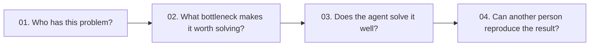
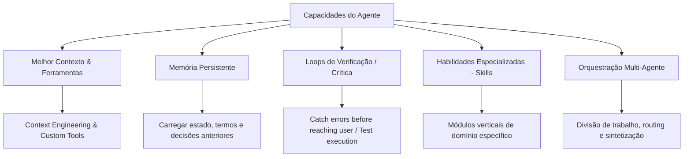
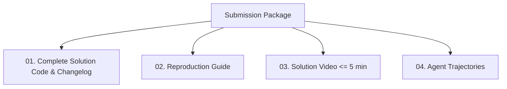

# Frontier Engineering Challenge 2026 — Guia Definitivo e Diretrizes de Auto-Regulação

> **Documento Oficial de Referência e Protocolo de Execução Técnica**  
> *Atualizado minuciosamente com base no `micro1.pdf` (Oficial Kickoff Release — Agentic Workflows Hackathon) e `Instructions.pdf` (HackerEarth Platform).*  
> *Este documento é a fonte única da verdade para estratégia, escolha de problema, arquitetura, benchmarking, changelog, validação e submissão.*

---

## 📑 Índice Geral

1. [Visão Geral do Desafio e Filosofia micro1](#1-visão-geral-do-desafio-e-filosofia-micro1)
2. [As 4 Perguntas Fundamentais (Core Questions)](#2-as-4-perguntas-fundamentais-core-questions)
3. [Espectro de Capacidades do Agente (Como Agentes Devem Ajudar)](#3-espectro-de-capacidades-do-agente-como-agentes-devem-ajudar)
4. [A Definição Canônica do Baseline (Os 4 Tipos Permitidos)](#4-a-definição-canônica-do-baseline-os-4-tipos-permitidos)
5. [Metodologia de Avaliação e Dataset de Teste (Regra dos 10+ Casos)](#5-metodologia-de-avaliação-e-dataset-de-teste-regra-dos-10-casos)
6. [O Padrão Oficial do Improvement Changelog](#6-o-padrão-oficial-do-improvement-changelog)
7. [Rubrica de Avaliação Oficial e Critérios de Desempate (100 Pontos)](#7-rubrica-de-avaliação-oficial-e-critérios-de-desempate-100-pontos)
8. [O Livro de Regras Oficiais (Ground Rules - 10 Mandamentos)](#8-o-livro-de-regras-oficiais-ground-rules---10-mandamentos)
9. [Os 4 Entregáveis Obrigatórios da Submissão (Submission Package)](#9-os-4-entregáveis-obrigatórios-da-submissão-submission-package)
10. [Os 3 Arquétipos de Referência Oficiais da micro1 (Estudos de Caso)](#10-os-3-arquétipos-de-referência-oficiais-da-micro1-estudos-de-caso)
11. [Cronograma, Fuso Horário e Prazos Críticos](#11-cronograma-fuso-horário-e-prazos-críticos)
12. [Premiação e Oportunidades de Contratação na micro1](#12-premiação-e-oportunidades-de-contratação-na-micro1)
13. [Protocolo Operacional de Auto-Regulação do Agente de IA](#13-protocolo-operacional-de-auto-regulação-do-agente-de-ia)
14. [Checklist Rigoroso de Pré-Submissão (Qualification Gate)](#14-checklist-rigoroso-de-pré-submissão-qualification-gate)
15. [FAQ Oficial e Considerações de IP](#15-faq-oficial-e-considerações-de-ip)

---

## 1. Visão Geral do Desafio e Filosofia micro1

### 🎯 O Core do Desafio: *"Build at the frontier of agentic AI"*
A **micro1** é uma plataforma e laboratório de dados de IA focado no treinamento de modelos de fronteira e avaliação rigorosa de agentes autônomos.

O tema central do hackathon é:
> *"A IA pode produzir código convincente em segundos. A engenharia real começa quando o convincente não é suficiente: requisitos incompletos, dependências ocultas, casos de borda difíceis, modos de falha e decisões que exigem julgamento técnico."*

### 🔑 Natureza do Desafio: Liberdade Temática com Rigor Metodológico Extremo
Diferente de competições com um único enunciado fechado, a micro1 estabelece:
- **Escolha do Problema:** O participante deve **escolher um problema específico e significativo que realmente compreenda** (*"Pick a specific and meaningful problem you understand"*).
- **Objetivo Prático:** Usar agentes para criar algo que pessoas reais queiram genuinamente usar no dia a dia.
- **Rigor de Evidência:** Demonstrar através de evidências empíricas e reprodutíveis que a solução de agentes supera substancialmente a forma como a tarefa é tratada hoje.

---

## 2. As 4 Perguntas Fundamentais (Core Questions)

Todo projeto submetido será julgado sob a ótica de quatro perguntas essenciais:



| Pergunta | O que deve ser respondido e demonstrado |
| :--- | :--- |
| **01. Who has this problem?** | Identificar claramente a **persona / usuário pretendido** (ex: engenheiros avaliando repositórios para M&A, recrutadores técnicos, times de localização/tradução de mídia, etc.). Quem sofre a dor? |
| **02. What bottleneck makes it worth solving?** | Descrever com precisão o **gargalo técnico ou operacional**. Por que processos manuais ou prompts ingênuos falham? Onde se perde tempo, precisão ou consistência? |
| **03. Does the agent solve it well?** | A solução entrega um resultado de alta fidelidade (*"com acabamento que alguém assinaria o próprio nome"*), tratando ambiguidades, orquestração e falhas? |
| **04. Can another person reproduce the result?** | Um avaliador terceiro consegue rodar a baseline, a solução avançada e o benchmark a partir de um **ambiente limpo**, obtendo os mesmos resultados? |

---

## 3. Espectro de Capacidades do Agente (Como Agentes Devem Ajudar)

A micro1 valoriza **decisões técnicas intencionais e justificadas**, e não o acúmulo desnecessário de complexidade (*"Purposeful choices matter more than the number of components"*).

A arquitetura pode utilizar uma ou mais das seguintes alavancas de engenharia de agentes:



1. **Contexto & Ferramentas Superiores:** Engenharia de prompts com esquemas estritos (Pydantic/JSON Schema), RAG estruturado e ferramentas sob medida.
2. **Memória:** Capacidade de carregar informações, preferências e decisões passadas para manter coerência global em tarefas longas.
3. **Verificação & Auto-Correção:** Módulos de validação que detectam erros, alucinações e falhas antes que o resultado chegue ao usuário final.
4. **Skills Especializadas:** Habilidades e heurísticas profundas em tarefas específicas.
5. **Orquestração Multi-Agente:** Separação intencional de responsabilidades entre agentes especializados com governança clara.

---

## 4. A Definição Canônica do Baseline (Os 4 Tipos Permitidos)

> [!IMPORTANT]
> **A Regra da Comparação Justa:** A solução Baseline e a Solução Final com Agentes devem receber **as exatas mesmas entradas e os mesmos casos de teste**. Qualquer diferença em recursos disponíveis deve ser documentada explicitamente.

A micro1 define formalmente **4 opções canônicas de Baseline**:

```mermaid
grid
    One direct prompt with basic instructions.
    One general purpose agent with basic tools.
    A simple script or template.
    The manual process people use today.
```

| Tipo de Baseline | Descrição | Exemplo de Implementação |
| :--- | :--- | :--- |
| **1. One direct prompt** | Um prompt direto único com instruções básicas enviadas a um LLM padrão. | Chamada zero-shot / few-shot a `gpt-4o` ou `claude-3-5-sonnet` sem loops de validação. |
| **2. One general-purpose agent** | Um agente genérico único munido apenas de ferramentas básicas de sistema (ex: bash simples, web search padrão). | Agente ReAct genérico sem skills customizadas nem memória estruturada. |
| **3. Simple script or template** | Um script determinístico tradicional ou template heurístico sem inteligência contextual adaptativa. | Script em Python com regex, regras estáticas de linting ou templates Jinja2 fixos. |
| **4. Manual process** | O processo manual que seres humanos realizam hoje para a mesma tarefa. | Registro de tempo, cliques e taxa de erro de um humano executando o fluxo manualmente. |

---

## 5. Metodologia de Avaliação e Dataset de Teste (Regra dos 10+ Casos)

### 📊 As 3 Métricas Centrais da micro1
A avaliação quantitativa deve conectar o Baseline à Solução Final através de uma tabela clara:

| Métrica | O que mede | Exemplo |
| :--- | :--- | :--- |
| **Primary Outcome (Métrica Primária)** | O resultado central de sucesso para o usuário | Taxa de testes aprovados (%), Acurácia de ranking (Spearman $\rho$), Precisão factual (%), F1-Score |
| **Human Time per Task** | Tempo gasto por humanos em intervenções ou revisão | Minutos economizados por execução (ex: 45 min $\rightarrow$ 3 min) |
| **Cost per Task** | Custo financeiro estimado por execução | Custo em USD de tokens de LLM (ex: \$0.42 por análise) |

### 🎯 Requisitos de Dataset de Avaliação
1. **Meta de Amostragem (10+ Casos):** *"Ten or more cases is a good target when the task allows it."* Devemos construir uma suíte com pelo menos 10 cenários/casos de teste realistas e independentes.
2. **Caso Desafiador Obrigatório (*The Challenging Case*):** A suíte DEVE incluir **pelo menos um caso propositalmente difícil/adversarial** (ex: sinais conflitantes, armadilhas de dependência oculta, inconsistências de contexto longo) e explicar detalhadamente no relatório o que esse caso revelou sobre o sistema.
3. **Métricas Customizadas:** Se as métricas padrão não se ajustarem perfeitamente ao seu domínio, crie uma rubrica própria bem definida e justificada no README para os juízes utilizarem.

---

## 6. O Padrão Oficial do Improvement Changelog

O **Improvement Changelog** é um dos componentes de maior peso na avaliação. Ele conta a história técnica da evolução do projeto.

### 📝 Estrutura Oficial da Tabela do Changelog

| Stage | What You Tried and Why | Evidence | Decision / Learning |
| :--- | :--- | :---: | :--- |
| **Baseline** | Iniciamos com [abordagem básica] | `[resultado baseline]` | Estabeleceu o ponto de partida e os gargalos iniciais. |
| **Iteration 1** | Adicionamos [skill/ferramenta X] para resolver [problema Y] | `[novo resultado]` | `[Mantido / Revisado / Removido]` — Justificativa. |
| **Iteration 2** | Implementamos verificação/reflexão após observar [falha Z] | `[novo resultado]` | `[Mantido / Revisado / Removido]` — Justificativa. |
| **Iteration 3** | Ajustamos a orquestração para melhorar [objetivo W] | `[novo resultado]` | `[Mantido / Revisado / Removido]` — Justificativa. |
| **Final** | Consolidamos as mudanças que funcionaram | `[resultado final]` | Identificada a contribuição principal para o salto de performance. |

> [!IMPORTANT]
> **Requisito Mandatório:** O changelog DEVE incluir **experimentos que falharam e foram removidos/descartados**, explicando o que essa falha ensinou sobre a dinâmica do problema.

---

## 7. Rubrica de Avaliação Oficial e Critérios de Desempate (100 Pontos)

> [!WARNING]
> **Qualification Gate:** Projetos que não executam a partir de um ambiente limpo ou cujos resultados não são reproduzíveis são sumariamente desqualificados antes da atribuição de notas.

### Tabela Oficial de Pontuação (100 Pontos)

| Critério | Pontos | O que o trabalho forte demonstra | Pergunta de Auto-Checagem (*Ask Yourself*) |
| :--- | :---: | :--- | :--- |
| **1. Problem & User Value** | **15 pts** | Resolve um problema relevante para um usuário claramente delimitado. | *Who experiences the bottleneck and why does solving it matter?* |
| **2. Agent Solution & Engineering** | **30 pts** *(Maior Peso)* | Utiliza agentes de forma intencional e tecnicamente sólida (contexto, ferramentas, memória, verificação, skills, orquestração). | *Which design choices helped the agent solve the problem?* |
| **3. End to End Quality** | **20 pts** | Conclui um fluxo de execução realista e autossuficiente, gerando um resultado com qualidade de entrega profissional (*"algo que alguém assinaria seu próprio nome, e não um rascunho de IA"*). | *Would the intended user consider this output high quality, or does it read as clearly AI generated?* |
| **4. Measured Improvement** | **15 pts** | Demonstra ganhos reais sobre uma baseline justa, usando o changelog para conectar cada iteração com evidências empíricas. | *Which changes truly improved the outcome?* |
| **5. Reproducibility** | **15 pts** | Fornece instruções claras e determinísticas para reproduzir a baseline e a solução avançada a partir de um ambiente limpo. | *Could they do it from a clean environment?* |
| **6. Hot Take / Insights** | **5 pts** | Converte um modo de falha observado na prática em uma lição técnica aplicável para o ecossistema de agentes. | *What did you learn and how would it change what you build next?* |
| **TOTAL** | **100 pts** | | |

### Ordem Oficial de Desempate (Tie-Break Order)
1. Maior pontuação em **Agent Solution & Engineering** (30 pts).
2. Maior pontuação em **Reproducibility** (15 pts).
3. Maior pontuação em **Measured Improvement** (15 pts).
4. Maior pontuação em **End to End Quality** (20 pts).
5. Revisão final das evidências pelos juízes técnicos da micro1.

---

## 8. O Livro de Regras Oficiais (Ground Rules - 10 Mandamentos)

Estes são os requisitos basilares inegociáveis de elegibilidade:

1. **Construção com Ferramentas Conhecidas (01):** Liberdade total para usar linguagens, frameworks e bibliotecas com os quais já tenha familiaridade.
2. **Atribuição Clara de Origem (02):** Deixar 100% explícito o que já existia antes da competição e o que foi desenvolvido durante o hackathon.
3. **Licenciamento e Termos de Serviço (03):** Respeitar rigorosamente os termos de uso de todas as APIs, modelos e ferramentas.
4. **Controle de Ações de Impacto (04 - Sandbox & Human Approval):** Ações com efeitos no mundo externo (envio de emails, escritas destrutivas, transações) devem ser simuladas/sandboxed e exigir aprovação humana prévia.
5. **Human-in-the-Loop (05 - HITL):** Incluir revisor humano qualificado em qualquer solução que possa afetar decisões críticas sobre pessoas.
6. **Ética e Legalidade (06):** Escolher um caso de uso legal, ético e que trate pessoas e dados com respeito.
7. **Privacidade e Dados Permitidos (07):** Utilizar dados públicos, sintéticos ou anonimizados devidamente autorizados.
8. **Segurança de Credenciais (08):** NUNCA commitar chaves de API, senhas ou tokens privados. Usar `.env.example`.
9. **Evidência Obrigatória (09):** Conectar cada alegação de melhoria a evidências concretas submetidas.
10. **Acesso Total aos Jurados (10):** Fornecer instruções e acessos suficientes para que os juízes executem o código e reproduzam o resultado do zero.

---

## 9. Os 4 Entregáveis Obrigatórios da Submissão (Submission Package)



### 01. Complete Solution Code and Improvement Changelog
- Repositório completo com todo o código-fonte, prompts do sistema, ferramentas e configurações.
- `README.md` exemplar contendo:
  - **Persona & Gargalo:** Quem tem o problema, qual o gargalo atual e por que solucioná-lo é valioso.
  - **Arquitetura da Solução:** Explicação detalhada da mecânica dos agentes, ferramentas e salvaguardas.
  - **Improvement Changelog:** Tabela cronológica com hipóteses, testes, evidências quantitativas e decisões.
  - **Principal Modo de Falha & Hot Take:** A maior falha observada durante os testes e a lição técnica extraída.

### 02. Reproduction Guide
- Escrito especificamente para um avaliador iniciando em um **ambiente limpo** (ex: container Docker novo ou máquina Linux/macOS limpa).
- Comandos exatos passo a passo para:
  1. Instalar dependências.
  2. Executar a **Baseline Solution**.
  3. Executar a **Advanced Solution**.
  4. Executar a suíte de **Evaluation / Benchmarking**.
- Especificação de dados de entrada, outputs esperados, versões exatas de pacotes, tempo estimado de execução (*runtime*) e custo aproximado de API de LLM.

### 03. Solution Video (Até 5 minutos)
- Roteiro estruturado sem enrolação:
  1. **Abertura:** Apresentação da persona, problema e demonstração rápida da Baseline.
  2. **Execução Realista (End-to-End):** Demonstração fluida da Solução Avançada resolvendo o problema do início ao fim.
  3. **Comparação & Resultados:** Demonstração lado a lado dos ganhos (Baseline vs Advanced).
  4. **Changelog & Lições:** Destaque para a mudança que **mais contribuiu** e um **experimento que falhou e foi removido**.

### 04. Agent Trajectories (Traces)
- Arquivos de traces/trajetórias legíveis e estruturados (`.json`, `.jsonl`, `.md` ou exportações de observabilidade):
  - Trajetórias representativas para **cada agente utilizado**.
  - Prompts iniciais do sistema e instruções.
  - Chamadas de ferramentas (*tool calls*) e respostas obtidas (*tool responses*).
  - Loops de auto-correção, retentativas automáticas e checkpoints de decisão humana (*human checkpoints*).

---

## 10. Os 3 Arquétipos de Referência Oficiais da micro1 (Estudos de Caso)

O documento oficial `micro1.pdf` traz 3 exemplos de referência que ilustram perfeitamente o padrão de qualidade esperado:

---

### 🏛️ Arquétipo 1: Code Analysis (*"Is this repository actually good?"*)
- **01. Who has this problem?** Um time de engenharia ou investidores avaliando a compra/incorporação de um repositório privado para estimar seu real valor e dívida técnica antes de fechar o negócio.
- **02. Bottleneck:** READMEs e demos não revelam a qualidade real do código. Avaliadores precisam entender bases desconhecidas, rodar builds/testes, inspecionar arquitetura, dependências, riscos de segurança, PRs e issues abertas. Sem método repetível, a avaliação é inconsistente.
- **03. Agent Solution:** O sistema analisa a base de código, executa testes estáticos e dinâmicos, e emite um relatório fundamentado com evidências. Testado contra 10 codebases com ranking estabelecido por revisores humanos seniores (o agente correlaciona com o ranking humano e justifica cada posição com evidências em arquivos e saídas de build).
- **04. Reproducibility:** Repositórios abertos de teste, comandos exatos, amarração de cada nota a arquivos, testes e saídas de build.

---

### 👔 Arquétipo 2: Candidate Evaluation (*"Should we hire this person?"*)
- **01. Who has this problem?** Recrutadores e gestores técnicos que precisam decidir sobre contratações com evidências dispersas em descrição da vaga, currículo, transcrições de entrevistas e testes práticos.
- **02. Bottleneck:** Avaliações isoladas perdem contradições ou dão peso excessivo a um único sinal. Candidatos parecem perfeitos superficialmente mas têm gaps ocultos; suspeitas de fraude/cola exigem evidência sólida antes de qualquer julgamento.
- **03. Agent Solution:** Agente centraliza as evidências, conecta requisitos da vaga a competências comprovadas, checa inconsistências temporais ou curriculares e exibe grau de incerteza, deixando a decisão final para o humano qualificado (HITL).
- **04. Reproducibility:** Casos sintéticos aprovados (incluindo 1 caso com sinais conflitantes intencionais), rastreamento de cada alerta até sua fonte documental exata.

---

### 🎙️ Arquétipo 3: Podcast Translation & Localization (*"Can every version still feel like the same show?"*)
- **01. Who has this problem?** Criadores de podcast e produtoras de mídia que traduzem e dublam programas para múltiplos idiomas mantendo a coerência editorial entre episódios passados e futuros.
- **02. Bottleneck:** O contexto abrange dezenas de horas de áudio. Episódios traduzidos isoladamente geram inconsistências acumuladas (mudança na pronúncia de nomes de personagens, tradução díspar de bordões e piadas com referências prévias).
- **03. Agent Solution:** Agente traduz preservando identidade de voz, glossário recorrente, tom, timing e histórico de episódios anteriores via memória e verificação terminológica.
- **04. Reproducibility:** Conjunto fixo de episódios de teste, glossário padronizado, caso desafiador dependente de detalhe recorrente do episódio 1 replicado no episódio 5.

---

## 11. Cronograma, Fuso Horário e Prazos Críticos

> [!IMPORTANT]
> **Fuso de Referência:** Todos os prazos oficiais são em **UTC**.  
> **Horário de Brasília (BRT):** `UTC-3` (ex: 23:59 UTC = 20:59 BRT).

```mermaid
timeline
    title Cronograma Oficial do Hackathon
    28 Ago - 15:00 UTC : Kickoff Oficial (micro1.pdf Liberado)
    29 Ago - 14:00 & 21:00 UTC : Office Hours (Sessões Globais de Q&A)
    29 Ago - 23:59 UTC : Fechamento das Inscrições
    30 Ago - 15:00 UTC : Final-Day Checkpoint
    30 Ago - 23:59 UTC : DEADLINE FINAL DE SUBMISSÃO (HackerEarth)
    31 Ago - 01 Set : Validation Screen (Triagem de Reprodutibilidade)
    02 Set - 04 Set : Judge Review (Equipe de Engenharia micro1)
    07 Set - 17:00 UTC : Anúncio dos Vencedores
```

- **Nosso Alvo de Entrega de Segurança:** Domingo, **30 de Agosto às 21:00 UTC (18:00 BRT)**, garantindo margem para upload de vídeo e checagem final.

---

## 12. Premiação e Oportunidades de Contratação na micro1

### 💰 Premiação em Dinheiro ($10,000 Total)
- 🥇 **1º Lugar:** $5,000 USD
- 🥈 **2º Lugar:** $3,000 USD
- 🥉 **3º Lugar:** $2,000 USD

### 🏆 3 Prêmios Especiais (Selective Awards)
1. **Best Engineering Workflow:** Excelência em arquitetura, código limpo, tratamento de falhas e automação.
2. **Most Useful Real-World Workflow:** Solução mais aplicável, prática e valiosa para usuários reais.
3. **Best Demonstrated Improvement:** Maior e mais convincente salto de qualidade da Baseline para a Solução Final, comprovado com dados e changelog.

### 💼 Contratações e Oportunidades de Trabalho
- Até **50 participantes de topo** serão convidados para vagas de engenharia remuneradas na micro1 (*Senior Software Engineer*, *Open Source Contributor*, *Backend Specialist*).
- Convite direto para o processo acelerado da micro1 com IA Recruiter.
- **Certificado Oficial Digital** para todas as submissões válidas que passarem pelo Qualification Gate.

---

## 13. Protocolo Operacional de Auto-Regulação do Agente de IA

> [!IMPORTANT]
> **Protocolo de Parceria (Como nós dois trabalharemos):**  
> Para atingir nota máxima (100/100) na rubrica da micro1, nosso processo seguirá as seguintes diretrizes automáticas:

1. **Separação Imediata de Baseline e Solução Avançada:**
   - Todo código será estruturado com interface unificada de execução para `baseline` e `advanced` sobre os mesmos dados de entrada.
2. **Registro Contínuo do Changelog:**
   - A cada alteração significativa de arquitetura, registraremos a hipótese, o teste e a métrica no `CHANGELOG.md`.
3. **Construção do Benchmark de 10+ Casos com Caso Desafiador:**
   - Criaremos a suíte de avaliação com pelo menos 10 casos concretos e documentaremos o caso com armadilha/sinais conflitantes.
4. **Isolamento de Credenciais e Sandboxing:**
   - Todas as chaves e segredos em `.env` (com `.env.example` completo). Ações destrutivas com confirmação explícita.
5. **Captura Automatizada de Trajetórias (Traces):**
   - Implementação de exportador estruturado de logs que salva prompts, tool calls, tool responses e retentativas em `.jsonl`.
6. **Planejamento do Vídeo de 5 Minutos:**
   - Construir o fluxo pensando no roteiro exato exigido pela micro1 para facilitar a gravação rápida.

---

## 14. Checklist Rigoroso de Pré-Submissão (Qualification Gate)

Antes de submeter na HackerEarth, todos os itens abaixo devem estar **100% verificados**:

- [ ] **As 4 Perguntas Respondidas:** `README.md` responde explicitamente às perguntas 01, 02, 03 e 04.
- [ ] **Dualidade Baseline vs. Advanced:** Implementadas e executáveis as duas versões sobre os mesmos inputs.
- [ ] **Dataset de Avaliação (10+ Casos):** Suíte de benchmark com no mínimo 10 casos e 1 caso desafiador documentado.
- [ ] **Métricas Documentadas:** Tabela comparando *Primary Outcome*, *Human Time* e *Cost per Task*.
- [ ] **Improvement Changelog Completo:** Registrada a progressão com evidências e **pelo menos 1 experimento descartado**.
- [ ] **Hot Take & Modo de Falha:** Documentada a principal falha observada e a lição técnica para agentes de IA.
- [ ] **Reprodutibilidade em Ambiente Limpo:** Testado script do zero (instalação, execução da baseline, avançado e benchmark).
- [ ] **Segurança & Variáveis:** `.env.example` documentado; nenhuma chave de API ou dado sensível commitado.
- [ ] **Agent Trajectories Exportados:** Arquivo com traces legíveis de todos os agentes usados (prompts, tool calls, responses).
- [ ] **Vídeo (< 5 min):** Vídeo gravado cobrindo: *Problema $\rightarrow$ Baseline $\rightarrow$ Execução E2E $\rightarrow$ Comparativo $\rightarrow$ Changelog & Lições*.
- [ ] **Submissão Antecipada:** Upload concluído antes do prazo final de Domingo, 30 de Agosto às 23:59 UTC.

---

## 15. FAQ Oficial e Considerações de IP

- **As inscrições são gratuitas?** Sim, 100% gratuitas.
- **Posso participar em equipe?** Não, a participação é estritamente individual.
- **A micro1 fornece créditos de API?** Não, o participante gerencia suas próprias chaves de LLM e custos.
- **Quais linguagens são permitidas?** Qualquer linguagem (Python, TypeScript, Rust, Go, Java, C++, etc.).
- **Propriedade Intelectual (IP):** Conforme os termos da competição, as submissões pertencem à micro1 para pesquisa, treinamento e benchmark de modelos de IA de fronteira.
- **Onde obter suporte oficial?** Via fórum do HackerEarth e nos horários de *Office Hours* (Sábado, 29 Ago às 14:00 e 21:00 UTC).

---
*Documento refinado e consolidado para execução do micro1 Frontier Engineering Challenge 2026.*
