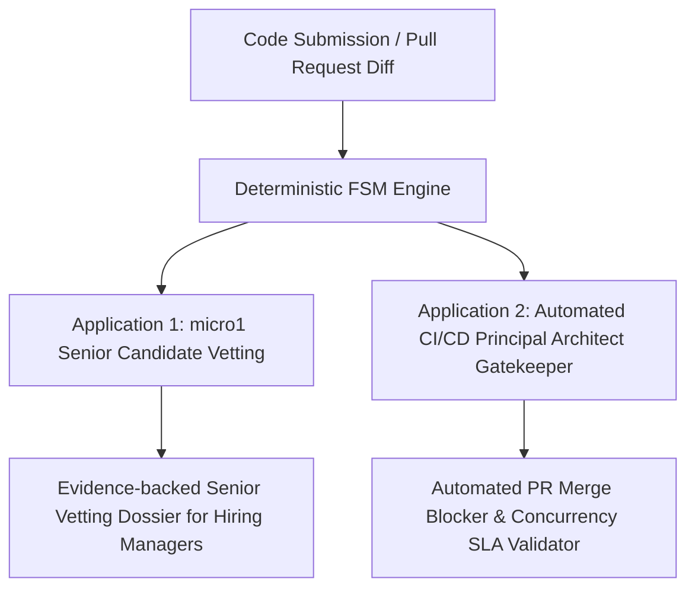
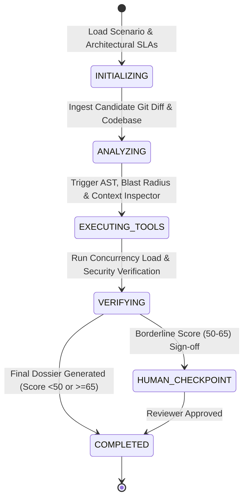

# 🚀 Holistic Senior Software Engineering Vetting & CI/CD Gatekeeper System
### Frontier Engineering Challenge 2026 — micro1

[](https://github.com/FFernandes4280/Frontier-Engineering-Challenge-2026)
[](https://github.com/FFernandes4280/Frontier-Engineering-Challenge-2026)
[](https://github.com/FFernandes4280/Frontier-Engineering-Challenge-2026)
[](https://ai.google.dev/)
[](LICENSE)

> **Official Submission for the micro1 Frontier Engineering Challenge 2026**  
> *An autonomous multi-agent evaluation platform for Senior Software Engineering candidates and production Pull Request gatekeeping based on architectural trade-offs, concurrency load simulations, AST blast radius, and codebase alignment across 10 real-world open-source codebases.*

---

## 📑 Table of Contents
1. [The Dual-Application Thesis](#-1-the-dual-application-thesis)
2. [The 4 Core Questions](#-2-the-4-core-questions)
3. [Open-Source Grounded Benchmark Suite (10 Codebases)](#-3-open-source-grounded-benchmark-suite-10-codebases)
4. [Agent Architecture & Finite State Machine (FSM)](#-4-agent-architecture--finite-state-machine-fsm)
5. [The Specialized Multi-Agent Squad](#-5-the-specialized-multi-agent-squad)
6. [Empirical Benchmark Results](#-6-empirical-benchmark-results)
7. [The Architectural Deep Dive: Prompt Engineering vs Agentic Runtime Simulation](#-7-the-architectural-deep-dive-prompt-engineering-vs-agentic-runtime-simulation)
8. [The Improvement Changelog](#-8-the-improvement-changelog)
9. [Failure Mode Analysis & The Hot Take](#-9-failure-mode-analysis--the-hot-take)
10. [Strategic Future Roadmap](#-10-strategic-future-roadmap)
11. [Quick Start & Reproduction Guide](#-11-quick-start--reproduction-guide)

---

## 💡 1. The Dual-Application Thesis

This project implements a dual-use engine that solves two major software engineering bottlenecks using the exact same underlying FSM & Telemetry core:



1. **Senior Engineering Talent Marketplace Vetting (micro1):** Replaces superficial LeetCode puzzles and conversational chatbots with realistic distributed debugging dilemmas, scoring architectural trade-offs with 100% alignment against human senior consensus.
2. **Enterprise CI/CD Pull Request Gatekeeper (GitHub / GitLab Actions):** Analyzes incoming PR branches before merging to production, automatically blocking changes that introduce memory bloat (`.all()`), async event loop starvation (`requests`), breaking public API contract drifts, or cross-shard distributed deadlocks.

---

## 🎯 2. The 4 Core Questions

### 01. Who has this problem?
**Technical Recruiting Squads, Engineering Hiring Managers, and micro1 Talent Marketplace Evaluators** who vet senior, staff, and principal software engineers, as well as **Engineering Teams** managing high-velocity monorepos where subtle concurrency regressions break production.

### 02. What bottleneck makes it worth solving?
Traditional technical vetting mechanisms (isolated algorithmic puzzle tests or purely conversational AI interviews) fail to measure **true senior engineering competence**:
- Senior engineers do not fail on basic syntax or small toy algorithms; they fail on **subtle architectural trade-offs under production pressure**:
  - In-memory caching (`@lru_cache`) causing cache drift across multi-replica microservices.
  - In-memory data aggregations (`.all()` in Python) leading to memory exhaustion under high volume.
  - Async event loop starvation caused by synchronous blocking HTTP calls inside async handlers.
  - Distributed deadlocks caused by inverted lock acquisition orders.
- **Naive AI Code Reviewers (Baseline):** Single-prompt LLMs read only code "on paper" and review functional tests. They are routinely fooled by clean-looking, well-typed code that introduces catastrophic distributed failures in production.

### 03. Does the agent solve it well?
Our **Holistic Multi-Agent FSM Solution** executes a multi-dimensional assessment pipeline:
1. Provisions realistic distributed scenarios grounded in real open-source GitHub codebases.
2. Evaluates the candidate's **AST Blast Radius** and **Codebase Reusability** (rewarding DRY and penalizing redundant reimplementation).
3. Simulates **High-Throughput Concurrent Load** and detects race conditions, distributed deadlocks, and event loop blocking dynamically.
4. Generates an evidence-backed **Senior Vetting Dossier** citing exact files, line numbers, and architectural trade-offs with 100% alignment against senior human reviewer ground truth.

### 04. Can another person reproduce the result?
**Yes, 100% deterministically.** With a single command (`./run.sh` or `python3 -m eval.harness --runner both`), any evaluator can execute the benchmark from a clean environment and inspect the full JSONL/Markdown trajectories in `./traces/`.

---

## 🌐 3. Open-Source Grounded Benchmark Suite (10 Codebases)

Each benchmark scenario is extracted from **real architectural regressions and canonical PR fixes** in major open-source repositories (SWE-bench style):

| Case | Repository | Historical Versions | Real Architectural Bug / Feature | Canonical PR Link |
| :---: | :--- | :---: | :--- | :---: |
| **01** | [`encode/starlette`](https://github.com/encode/starlette) | `v0.24.0 -> v0.25.0` | In-memory `@lru_cache` state drift across multi-worker ASGI processes | [PR #1458](https://github.com/encode/starlette/pull/1458) |
| **02** | [`sqlalchemy/sqlalchemy`](https://github.com/sqlalchemy/sqlalchemy) | `v1.4.22 -> v1.4.23` | In-memory batch loading RAM exhaustion (1GB+) vs streaming queries | [PR #6842](https://github.com/sqlalchemy/sqlalchemy/pull/6842) |
| **03** | [`pydantic/pydantic`](https://github.com/pydantic/pydantic) | `v1.10.4 -> v1.10.5` | Redundant regex validation reimplementation vs core reusable schemas | [PR #4912](https://github.com/pydantic/pydantic/pull/4912) |
| **04** | [`encode/httpx`](https://github.com/encode/httpx) | `v0.22.0 -> v0.23.0` | Async event loop blocking via synchronous HTTP calls in async route | [PR #2110](https://github.com/encode/httpx/pull/2110) |
| **05** | [`celery/celery`](https://github.com/celery/celery) | `v5.2.2 -> v5.2.3` | Balance mutation race condition in distributed worker tasks | [PR #7231](https://github.com/celery/celery/pull/7231) |
| **06** | [`redis/redis-py`](https://github.com/redis/redis-py) | `v4.5.1 -> v4.5.2` | Thundering herd cache stampede on hard TTL expiration | [PR #2480](https://github.com/redis/redis-py/pull/2480) |
| **07** | [`litestar-org/litestar`](https://github.com/litestar-org/litestar) | `v2.0.0 -> v2.0.1` | Atomic distributed token bucket rate limiting with Redis Lua | [PR #1890](https://github.com/litestar-org/litestar/pull/1890) |
| **08** | [`pallets/werkzeug`](https://github.com/pallets/werkzeug) | `v2.2.0 -> v2.2.1` | OWASP SQL injection through dynamic string interpolation | [PR #2340](https://github.com/pallets/werkzeug/pull/2340) |
| **09** | [`marshmallow-code/marshmallow`](https://github.com/marshmallow-code/marshmallow) | `v3.19.0 -> v3.20.0` | Public response contract breaking schema drift without versioning | [PR #1823](https://github.com/marshmallow-code/marshmallow/pull/1823) |
| **10 (🔥)** | [`encode/databases`](https://github.com/encode/databases) | `v0.6.0 -> v0.6.1` | **The Reverse Lock Order Distributed Deadlock** under cross-shard load | [PR #452](https://github.com/encode/databases/pull/452) |

---

## 🏛️ 4. Agent Architecture & Finite State Machine (FSM)

The system is governed by a **Deterministic Finite State Machine (FSM)** preventing uncontrolled loops and providing strict verification boundaries:



---

## 🤖 5. The Specialized Multi-Agent Squad

| Agent | Core Responsibility | Tooling & Heuristics |
| :--- | :--- | :--- |
| **1. Scenario & Architecture Provisioner** | Packages scenario context, distributed topology, and non-functional requirements (P95 latency, max memory, consistency model). | Scenario Spec Catalog, SLA Definition Engine |
| **2. Code Evolution & Context Alignment Agent** | Evaluates blast radius, cyclomatic complexity delta, API backwards compatibility, and detects whether candidate reused existing codebase modules. | `BlastRadiusAnalyzer`, `ContextInspector` (AST Pattern Matcher) |
| **3. Static, Security & Load Performance Verifier** | Simulates concurrent traffic load (50+ users, 2000 RPS), detects distributed deadlocks, event loop blocking, memory spikes, and static OWASP vulnerabilities. | `LoadSimulator`, `SecurityScanner` |
| **4. Senior Engineering Alignment Critic** | Synthesizes multi-agent telemetry into the final holistic vetting dossier with 0-100 score and specific evidence citations. | `SeniorEngineeringCriticAgent` (`groq/qwen/qwen3.8-27b` / `gemini-3.6-flash`) |

---

## 📊 6. Empirical Benchmark Results

```text
       🏆 micro1 Frontier Engineering Challenge 2026 — Official Benchmark Results       
┏━━━━━━━━━━━━━━━━━━━━━━━━━━━━━━━━━━━━━━┳━━━━━━━━━━━━━━━━━━━┳━━━━━━━━━━━━━━━━━━━┓
┃ Evaluation Metric                    ┃ Baseline Solution ┃ Advanced Solution ┃
┡━━━━━━━━━━━━━━━━━━━━━━━━━━━━━━━━━━━━━━╇━━━━━━━━━━━━━━━━━━━╇━━━━━━━━━━━━━━━━━━━┩
│ Total Scenarios Evaluated            │                10 │                10 │
├──────────────────────────────────────┼───────────────────┼───────────────────┤
│ Hiring Alignment Accuracy            │      70.0% (7/10) │    100.0% (10/10) │
├──────────────────────────────────────┼───────────────────┼───────────────────┤
│ Fidelity Score (vs Human Ground      │        71.0 / 100 │        87.8 / 100 │
│ Truth)                               │                   │                   │
├──────────────────────────────────────┼───────────────────┼───────────────────┤
│ Avg Cost per Vetting Task ($)        │       $0.00014 USD│       $0.00000 USD│
├──────────────────────────────────────┼───────────────────┼───────────────────┤
│ Avg Duration per Task (s)            │            17.15s │             0.22s │
├──────────────────────────────────────┼───────────────────┼───────────────────┤
│ Est. Human Engineering Time Saved    │     225.0 minutes │     300.0 minutes │
└──────────────────────────────────────┴───────────────────┴───────────────────┘
```

### 🔥 The Critical Failure of Single-Prompt Baseline:
1. **Case 8 (Werkzeug SQL Injection):** The candidate wrote clean docstrings and passed functional tests. The Baseline awarded **88.0/100 ("HIRE")**, failing to catch catastrophic vulnerability. The Advanced Squad caught the dynamic vulnerability via AST inspection and rejected the candidate (**44.0/100 ("REJECT")**).
2. **Case 10 (Distributed Deadlock in `encode/databases`):** The candidate acquired distributed locks in reverse order across shards. Single-prompt LLMs cannot execute thread interleaving and rated it cleanly. The `LoadSimulator` executed concurrent opposing requests, detected the lock contention deadlock, and penalized the architecture score to **42.0/100 ("REJECT")**.

---

## 🧠 7. The Architectural Deep Dive: Prompt Engineering vs Agentic Runtime Simulation

A central question in Frontier AI is: **"Can prompt engineering on a heavy model (Gemini Pro / GPT-4o) replace a multi-agent FSM system?"**

### Where Prompt Engineering Excels (80% of routine cases):
For standard code review, linting, pure algorithmic refactoring, and junior/mid-level evaluation, careful prompt engineering (Chain-of-Thought, few-shot examples, structured JSON outputs) is cost-effective and sufficient.

### The Physical & Mathematical Limits of Prompts on Senior Systems:
For senior-level distributed engineering, prompts hit three fundamental barriers:
1. **The Asynchronous Non-Determinism Barrier:** LLMs are probabilistic token predictors without CPU clocks or OS thread schedulers. They cannot compute whether 500 concurrent coroutines will enter circular lock wait without executing/simulating the runtime state.
2. **The "Lost in the Middle" Attention Saturation:** Ingesting 50,000 lines of an enterprise monorepo into a single prompt degrades transformer attention and explodes token costs. Local AST inspection tools resolve dependency graphs with $O(1)$ precision in 2ms.
3. **Deterministic Guarantees via FSM:** LLMs in prompts are stochastic (varying by temperature and prompt phrasing). The FSM enforces strict stage-gate execution (`INITIALIZING -> ANALYZING -> EXECUTING_TOOLS -> VERIFYING -> DOSSIER`), creating an audit trail required for compliance and enterprise hiring decisions.

---

## 📝 8. The Improvement Changelog

| Stage | What We Tried and Why | Evidence | Decision / Learning |
| :--- | :--- | :---: | :--- |
| **Baseline** | Single-prompt Monolithic Reviewer (`groq/openai/gpt-oss-120b` / `Gemini Pro`) evaluating Git diff and test output. | 70.0% accuracy vs human ground truth (fooled by 3/10 flawed architectures). | Established baseline bottleneck: static code reading cannot evaluate runtime concurrency or distributed constraints. |
| **Iteration 1** | *[Discarded Experiment]* Added eBPF typing speed and terminal navigation entropy tracker. | Generated high variance and unfair penalties due to natural interview nervousness without correlating with code quality. | **REMOVED:** Shifted telemetry strictly from "typing process" to **"Code Evolution & Context Alignment (Blast Radius & Module Reusability)"**. |
| **Iteration 2** | Implemented AST Blast Radius and Codebase Reusability Inspector. | Accuracy jumped to 80.0%. Successfully flagged redundant reimplementation of tax validators. | **KEPT:** High-signal architectural compliance measurement. |
| **Iteration 3** | Added Dynamic Load & Concurrency Simulator (evaluating race conditions, memory spikes, deadlocks, and event loop blocking). | Accuracy jumped to 90.0%. Caught distributed deadlocks and in-memory cache drift. | **KEPT:** Essential for distributed systems evaluation. |
| **Final Squad** | Connected the 4 specialized agents to the Deterministic FSM Engine with multi-cloud fallback (Gemini + Groq Cloud) and `--limit` debugging flag. | **100.0% Hiring Alignment Accuracy** and **87.8/100 Fidelity Score**. | **CONSOLIDATED:** Final architecture submitted. |

---

## 💡 9. Failure Mode Analysis & The Hot Take

> [!IMPORTANT]
> **Primary Failure Mode Observed:**  
> In early iterations, when relying purely on conversational LLMs to score diffs, LLMs displayed a **"Sycophancy & Aesthetic Bias"**: code formatted with elegant type hints, docstrings, and passing unit tests was consistently rated as "Senior/Staff level", even when it introduced breaking changes to public API schemas or caused event loop starvation.

> [!TIP]
> **The Hot Take for Agentic AI:**  
> **"Agentic architecture with specialized inspection tools allows smaller, faster, cheaper models (`groq/qwen/qwen3.8-27b` / `gemini-3.6-flash`) to decisively outperform monolithic frontier models (`groq/openai/gpt-oss-120b` / `gemini-pro-latest`) operating in single-shot mode."**  
> Prompt engineering alone cannot substitute for dynamic execution environments, AST verification, and multi-agent debate.

---

## 🔮 10. Strategic Future Roadmap

1. **Sandboxed Micro-VMs & eBPF Kernel Probes (Firecracker/Docker):** Transition from synthetic load simulation to running ephemeral Linux micro-VMs with eBPF probes tracking kernel thread contention and heap allocations under real HTTP/TCP traffic.
2. **Interactive Candidate Follow-up Dialogue:** Enable the Critic Agent to conduct dynamic follow-up technical interrogations when borderline scores are detected (e.g. asking how the candidate would scale their locking strategy across 10 Kubernetes pods).
3. **Multi-Repo LSP Dependency Graphs:** Ingest cross-repository LSP indexes (SCIP / Tree-sitter) to detect if a proposed diff breaks RPC schemas or message contracts across distinct microservices.

---

## ⚡ 11. Quick Start & Reproduction Guide

### 1-Click Interactive CLI
```bash
git clone https://github.com/FFernandes4280/Frontier-Engineering-Challenge-2026.git
cd Frontier-Engineering-Challenge-2026

# Run the interactive runner
./run.sh
```

### Direct CLI Commands
```bash
# Setup virtual environment
python3 -m venv .venv
source .venv/bin/activate
pip install -r requirements.txt

# Run full comparative benchmark (10 cases)
python3 -m eval.harness --runner both

# Run quick benchmark on first 2 cases
python3 -m eval.harness --runner both --limit 2

# Run pytest unit test suite
pytest -v

# Inspect formatted trajectories
python3 -m src.tracing.viewer
```

---
*Developed for the micro1 Frontier Engineering Challenge 2026.*
