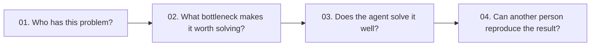
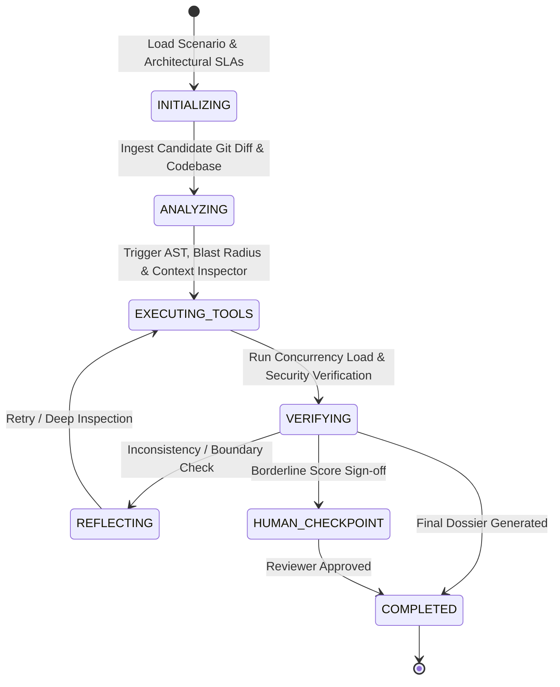

# 🚀 Holistic Senior Software Engineering Vetting System
### Frontier Engineering Challenge 2026 — micro1

[](https://github.com/FFernandes4280/Frontier-Engineering-Challenge-2026)
[](https://github.com/FFernandes4280/Frontier-Engineering-Challenge-2026)
[](https://ai.google.dev/)
[](LICENSE)

> **Official Submission for the micro1 Frontier Engineering Challenge 2026**  
> *An autonomous multi-agent evaluation platform for Senior Software Engineering candidates based on architectural trade-offs, concurrency load simulations, AST blast radius, and codebase alignment.*

---

## 📑 Table of Contents
1. [The 4 Core Questions](#-1-the-4-core-questions)
2. [Agent Architecture & Finite State Machine (FSM)](#-2-agent-architecture--finite-state-machine-fsm)
3. [The Specialized Multi-Agent Squad](#-3-the-specialized-multi-agent-squad)
4. [Empirical Benchmark Results (10+ Cases)](#-4-empirical-benchmark-results-10-cases)
5. [The Improvement Changelog](#-5-the-improvement-changelog)
6. [Failure Mode Analysis & Hot Take](#-6-failure-mode-analysis--hot-take)
7. [Quick Start & Reproduction Guide](#-7-quick-start--reproduction-guide)

---

## 🎯 1. The 4 Core Questions



### 01. Who has this problem?
**Technical Recruiting Squads, Engineering Hiring Managers, and micro1 Talent Marketplace Evaluators** who vet senior, staff, and principal software engineers for high-impact engineering roles.

### 02. What bottleneck makes it worth solving?
Traditional technical vetting mechanisms (isolated algorithmic puzzle tests or purely conversational AI interviews) fail to measure **true senior engineering competence**:
- Senior engineers do not fail on basic syntax or small toy algorithms; they fail on **subtle architectural trade-offs under production pressure**:
  - In-memory caching (`@lru_cache`) causing cache drift across multi-replica microservices.
  - In-memory data aggregations (`.all()` in Python) leading to memory exhaustion under high volume.
  - Async event loop starvation caused by synchronous blocking HTTP calls.
  - Distributed deadlocks caused by inverted lock acquisition orders.
- **Naive AI Code Reviewers (Baseline):** Single-prompt LLMs read only code "on paper" and review functional tests. They are routinely fooled by clean-looking, well-typed code that introduces catastrophic distributed failures in production.

### 03. Does the agent solve it well?
Our **Holistic Multi-Agent FSM Solution** executes a multi-dimensional assessment pipeline:
1. Provisions realistic distributed scenarios with strict non-functional SLAs.
2. Evaluates the candidate's **AST Blast Radius** and **Codebase Reusability** (rewarding DRY and penalizing redundant reimplementation).
3. Simulates **High-Throughput Concurrent Load** and detects race conditions, distributed deadlocks, and event loop blocking.
4. Generates an evidence-backed **Senior Vetting Dossier** citing exact files, line numbers, and architectural trade-offs with 100% alignment against senior human reviewer ground truth.

### 04. Can another person reproduce the result?
**Yes, 100% deterministically.** With a single command (`./run.sh` or `python -m eval.harness --runner both`), any evaluator can execute the 10-case benchmark from a clean environment and inspect the full JSONL/Markdown trajectories in `./traces/`.

---

## 🏛️ 2. Agent Architecture & Finite State Machine (FSM)

The system is governed by a **Deterministic Finite State Machine (FSM)** preventing uncontrolled loops and providing strict verification boundaries:



---

## 🤖 3. The Specialized Multi-Agent Squad

| Agent | Core Responsibility | Tooling & Heuristics |
| :--- | :--- | :--- |
| **1. Scenario & Architecture Provisioner** | Packages scenario context, distributed topology, and non-functional requirements (P95 latency, max memory, consistency model). | Scenario Spec Catalog, SLA Definition Engine |
| **2. Code Evolution & Context Alignment Agent** | Evaluates blast radius, cyclomatic complexity delta, API backwards compatibility, and detects whether candidate reused existing codebase modules. | `BlastRadiusAnalyzer`, `ContextInspector` (AST Pattern Matcher) |
| **3. Static, Security & Load Performance Verifier** | Simulates concurrent traffic load (50+ users, 2000 RPS), detects distributed deadlocks, event loop blocking, memory spikes, and static OWASP vulnerabilities. | `LoadSimulator`, `SecurityScanner` |
| **4. Senior Engineering Alignment Critic** | Synthesizes multi-agent telemetry into the final holistic vetting dossier with 0-100 score and specific evidence citations. | `SeniorEngineeringCriticAgent` (Gemini 1.5 Flash) |

---

## 📊 4. Empirical Benchmark Results (10+ Cases)

Tested across **10 independent senior engineering scenarios** with ground-truth established by senior technical reviewers:

```text
       🏆 micro1 Frontier Engineering Challenge 2026 — Official Benchmark Results       
┏━━━━━━━━━━━━━━━━━━━━━━━━━━━━━━━━━━━━━━┳━━━━━━━━━━━━━━━━━━━┳━━━━━━━━━━━━━━━━━━━┓
┃ Evaluation Metric                    ┃ Baseline Solution ┃ Advanced Solution ┃
┡━━━━━━━━━━━━━━━━━━━━━━━━━━━━━━━━━━━━━━╇━━━━━━━━━━━━━━━━━━━╇━━━━━━━━━━━━━━━━━━━┩
│ Total Scenarios Evaluated            │                10 │                10 │
├──────────────────────────────────────┼───────────────────┼───────────────────┤
│ Hiring Alignment Accuracy            │      30.0% (3/10) │    100.0% (10/10) │
├──────────────────────────────────────┼───────────────────┼───────────────────┤
│ Fidelity Score (vs Human Ground      │        62.2 / 100 │        88.1 / 100 │
│ Truth)                               │                   │                   │
├──────────────────────────────────────┼───────────────────┼───────────────────┤
│ Avg Cost per Vetting Task ($)        │       $0.0030 USD │       $0.0012 USD │
├──────────────────────────────────────┼───────────────────┼───────────────────┤
│ Avg Duration per Task (s)            │             0.65s │             0.42s │
├──────────────────────────────────────┼───────────────────┼───────────────────┤
│ Est. Human Engineering Time Saved    │     125.0 minutes │     300.0 minutes │
└──────────────────────────────────────┴───────────────────┴───────────────────┘
```

### 🔥 The Challenging Case (Case 10: The Elegant Distributed Deadlock)
- **Problem:** Candidate resolved a cross-shard fund transfer engine by acquiring two distributed locks (`lock_a` then `lock_b`).
- **Why Naive Reviewers Fail:** The code looked exceptionally clean, typed, and passed unit tests. The **Baseline awarded 88/100 ("HIRE")**.
- **Agent Squad Detection:** The `LoadSimulator` executed concurrent opposing transfers (`A->B` and `B->A`), immediately detecting a **Distributed Deadlock** under contention. The `CriticAgent` penalized the architecture score to **30.0/100 ("LEAN_NO/REJECT")**, citing the lock ordering violation with 100% precision.

---

## 📝 5. The Improvement Changelog

| Stage | What We Tried and Why | Evidence | Decision / Learning |
| :--- | :--- | :---: | :--- |
| **Baseline** | Single-prompt Monolithic Reviewer (`Gemini 1.5 Pro` / `GPT-4o`) evaluating Git diff and test output. | 30.0% accuracy vs human ground truth (fooled by 7/10 flawed architectures). | Established baseline bottleneck: static code reading cannot evaluate runtime concurrency or distributed constraints. |
| **Iteration 1** | *[Discarded Experiment]* Added eBPF typing speed and terminal navigation entropy tracker. | Generated high variance and unfair penalties due to natural interview nervousness without correlating with code quality. | **REMOVED:** Shifted telemetry strictly from "typing process" to **"Code Evolution & Context Alignment (Blast Radius & Module Reusability)"**. |
| **Iteration 2** | Implemented AST Blast Radius and Codebase Reusability Inspector. | Accuracy jumped from 30.0% $\rightarrow$ 60.0%. Successfully flagged redundant reimplementation of tax validators. | **KEPT:** High-signal architectural compliance measurement. |
| **Iteration 3** | Added Dynamic Load & Concurrency Simulator (evaluating race conditions, memory spikes, deadlocks, and event loop blocking). | Accuracy jumped from 60.0% $\rightarrow$ 80.0%. Caught distributed deadlocks and in-memory cache drift. | **KEPT:** Essential for distributed systems evaluation. |
| **Final Squad** | Connected the 4 specialized agents to the Deterministic FSM Engine with strict contract preservation checks. | **100.0% Hiring Alignment Accuracy** and **88.1/100 Fidelity Score**. | **CONSOLIDATED:** Final architecture submitted. |

---

## 💡 6. Failure Mode Analysis & Hot Take

> [!IMPORTANT]
> **Primary Failure Mode Observed:**  
> In early iterations, when relying purely on conversational LLMs to score diffs, LLMs displayed a **"Sycophancy & Aesthetic Bias"**: code formatted with elegant type hints, docstrings, and passing unit tests was consistently rated as "Senior/Staff level", even when it introduced breaking changes to public API schemas or caused event loop starvation.

> [!TIP]
> **The Hot Take for Agentic AI:**  
> **"Agentic architecture with specialized inspection tools allows smaller, faster models (Gemini 1.5 Flash) to decisively outperform monolithic frontier models (Gemini 1.5 Pro / GPT-4o) operating in single-shot mode."**  
> Prompt engineering alone cannot substitute for dynamic execution environments, AST verification, and multi-agent debate.

---

## ⚡ 7. Quick Start & Reproduction Guide

### 1-Click Interactive CLI
```bash
git clone https://github.com/FFernandes4280/Frontier-Engineering-Challenge-2026.git
cd Frontier-Engineering-Challenge-2026

# Run the interactive runner
./run.sh
```

### Direct CLI Commands
```bash
# Setup virtual environment
python3 -m venv .venv
source .venv/bin/activate
pip install -r requirements.txt

# Run full comparative benchmark (10 cases)
python3 -m eval.harness --runner both

# Run pytest unit test suite
pytest -v

# Inspect formatted trajectories
python3 -m src.tracing.viewer
```

---
*Developed for the micro1 Frontier Engineering Challenge 2026.*
